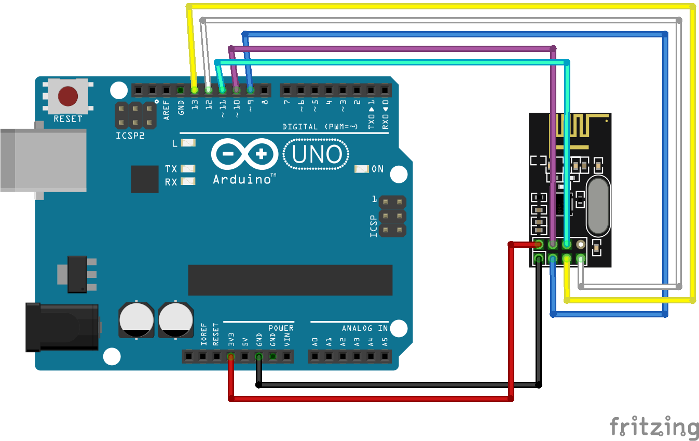

## Setup

 - Running rf_scanner-arduino.ino

 - Wiring:

    

## Example output

    RRF24 scanner
    
    SPI Speedz	= 10 Mhz
    STATUS		= 0x0e RX_DR=0 TX_DS=0 MAX_RT=0 RX_P_NO=7 TX_FULL=0
    RX_ADDR_P0-1	= 0xe7e7e7e7e7 0xc2c2c2c2c2
    RX_ADDR_P2-5	= 0xc3 0xc4 0xc5 0xc6
    TX_ADDR		= 0xe7e7e7e7e7
    RX_PW_P0-6	= 0x20 0x20 0x20 0x20 0x20 0x20
    EN_AA		= 0x00
    EN_RXADDR	= 0x01
    RF_CH		= 0x4c
    RF_SETUP	= 0x07
    CONFIG		= 0x0e
    DYNPD/FEATURE	= 0x00 0x00
    Data Rate	= 1 MBPS
    Model		= nRF24L01+
    CRC Length	= 16 bits
    PA Power	= PA_MAX
    ARC		= 0
    
    000000000000000000000000001100000000000000000000000000000000000000000002120000000100000000000000000000000000000000000000000000
    011000000000000000000000011100000000000000000000000000000000000000000000000000012200000000000000000000000000000000000000000000
    000100000000000000000000002000000000000000000000000000000000000000000000000000001100000000000000000000000000000000000000000000
    001000000000000000000000000000000000000000000000000000000000000000000000000000002200000000000000000000000000000000000000000000
    000200000000000000000000000000000000000000000000000000000000000000000011100000003000000000000000000000000000000000000000000000
    000000000000000000000000012000000000000000000000000000000000000000000001120000003100000000000000000000000000000000000000000000
    001000000000000000000000010100000000000000000000000000000000000000000000000000000000000000000000000000000000000000000000000000
    001000000000000000000000003000000000000000000000000000000000000000000000000000001000000000000000000000000000000000000000000000
    010000000000000000000000002100000000000000000000000000000000000000000000000000001000000000000000000000000000000000000000000000
    003000000000000000000000003000000000000000000000000000000000000000000001010000013100000000000000000000000000000000000000000000
