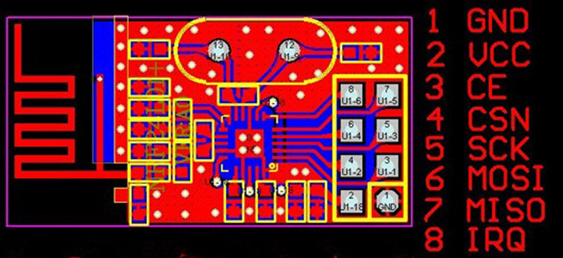

# nRF24L01+

The network will be built using the nRF24L01+ module. It operates in the 2.4GHz band, aka the [ISM band]( https://en.wikipedia.org/wiki/ISM_band), aka the band used by WiFi, cordless phones, and Bluetooth.

This module has excellent support with an optimised library called [RF24]( https://tmrh20.github.io/RF24/) that is compatible with both the Arduino and Raspberry Pi, and comes with a collection of libraries built on top of the base RF24 library for setup of various communication systems (including mesh networks). 

## Module versions

There are several versions of the nRF24L01+ module at the time of writing that provide successively greater transmission ranges.

- Basic module with onboard antenna
- Basic module with duck antenna
- Power amplified / Low Noise amplified module with duck antenna

For this work I am using the basic module with onboard antenna as its range should suffice, especially when implementing in a mesh network which should help extend the range from the main node.

## Fake Modules

Care must be taken when purchasing the nRF24L01+ modules as there are many fakes out there which will sometimes work, but not to spec ([Link 1]( https://forum.mysensors.org/topic/1153/we-are-mostly-using-fake-nrf24l01-s-but-worse-fakes-are-emerging), [Link 2](https://forum.mysensors.org/topic/1664/which-are-the-best-nrf24l01-modules)). For this work I went with the units sold by [Itead]( https://www.itead.cc/nrf24l01-module.html) as they seemed to be a good bet, and so far they are performing as expected.

## Module Pinout

Note that while the logic pins are 5V tolerant VCC is not and must be supplied with 1.9V - 3.9V. This is not an issue in either the RPi or Arduino as they provide 3.3V VCC connections. To reduce noise and thereby improve connectivity (particularly in higher power modes) it is recommended to attach a 10µF capacitor across the power supply as close to the module as possible, even directly between the GND and VCC pins, 

